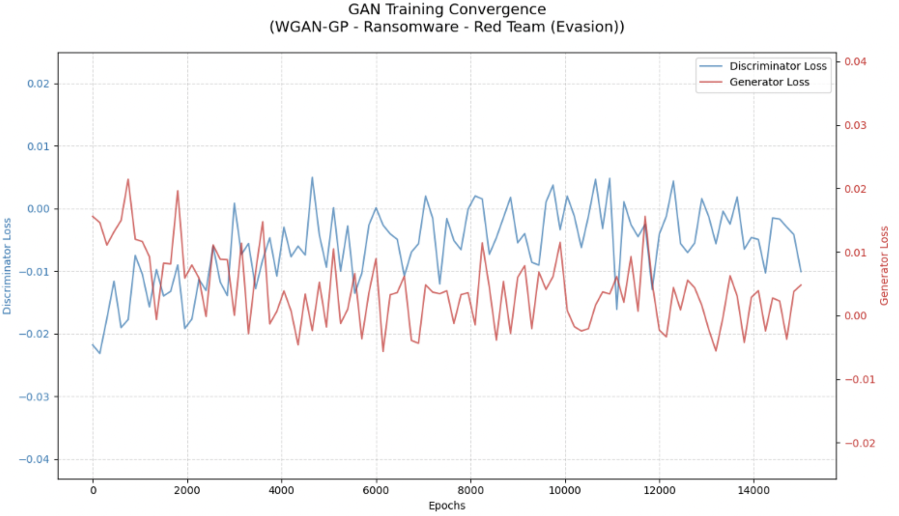
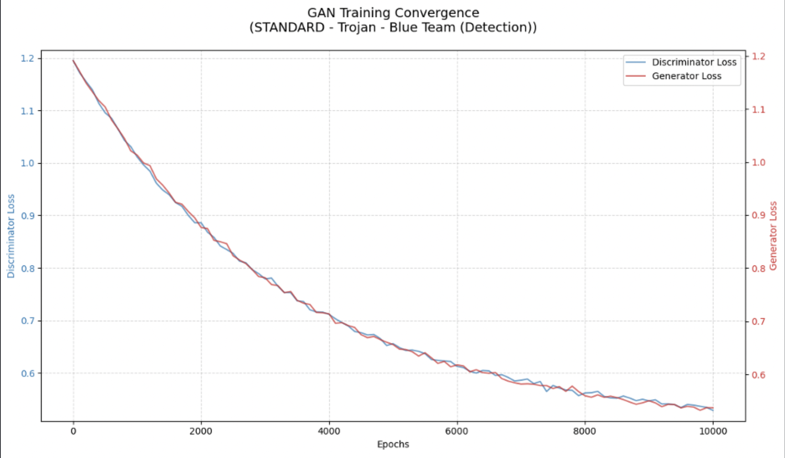

#  Graph Reaper: A Link-State Actor

Author: Rhette Wallach

This tool simulates and visualizes the training convergence of a Generative Adversarial Network (GAN) for cybersecurity applications involving AI-generated malware. It allows customization for different malware types (e.g., ransomware and trojans) and team objectives (i.e., red team for evasion amd blue team for detection). 
For advanced users, the script can be adapted to handle actual malware datasets, providing a more realistic training environment. The script generates a dual-axis line graph showing how generator and discriminator losses evolve over epochs, helping users determine when GAN training stabilizes for their specific use case.

## Features

- **Team-Specific Adjustments:**
  - **Red Team (Evasion):** Optimized for generating evasive malware variants with longer training epochs and advanced GAN types (e.g., WGAN-GP).
  - **Blue Team (Detection):** Tailored for generating synthetic malware samples for training detection models using standard GAN types for stability.
- **Malware-Specific Customization:**
  - Supports different malware types (i.e., ransomware, trojan, and other) with adjusted loss decay rates and noise levels to reflect real-world complexity.
- **Customizable Parameters:**
  - Number of epochs
  - Learning rate
  - Batch size
  - GAN type (WGAN-GP or standard)
  - Team objective (red or blue)
  - Malware type (ransomware, trojan, and other)
- **Loss Simulation with Noise:**
  - Simulates realistic GAN training dynamics with exponential decay and Gaussian noise to mimic the variability of AI-generated malware.
- **Convergence Graph:**
  - Generates a dual-axis plot with discriminator loss (left Y-axis) and generator loss (right Y-axis), including a grid and legend for clarity.
- **Support for Actual Malware Data:**
  - Advanced users can integrate real malware datasets (e.g., from VX Underground or VirusShare) by modifying the script to load and process malware features (e.g., byte sequences and API calls).

---

## Requirements

- Python 3.6+
- Matplotlib
- NumPy
- *(Optional for real data)* Additional libraries like `pefile` for static analysis or sandbox tools for dynamic analysis.

## Installation

1. Clone this repo or download the script.
2. Ensure Python 3.6+ is installed.
3. Install all nesscary dependencies by running the command below. Note for real malware data processing, additional dependencies may be required (e.g., pefile for PE file analysis).
    ```bash
    pip install matplotlib numpy
    ```

## Usage

Below are the command line options several examples of how to utlize the script.

### Command Line Options

|     Option     |                      Description                     | Default |
|:--------------:|:----------------------------------------------------:|:-------:|
| --epochs       | Number of training epochs                            | 10000   |
| --lr           | Learning rate for the GAN                            | 0.0001  |
| --batch_size   | Batch size for training                              | 32      |
| --gan_type     | Type of GAN (wgan-gp or standard)                    | wgan-gp |
| --team         | Team objective (red for evasion, blue for detection) | red     |
| --malware_type | Type of malware (ransomware, trojan, other)          | other   |

### Basic Simulation Mode

Execute the script via the command line with default or custom parameters. Default execution is equal to supplying the parameters Red Team, WGAN-GP, 12,000 epochs, and Other Malware.

```python
python  Graph_Reaper.py
```
### Red Team Graph_Reaper Example

The command below uses the Ransomware, 15,000 epochs, and WGAN-GP options to produce the following graph.

```python
python Graph_Reaper.py --epochs 15000 --lr 0.00005 --batch_size 64 --gan_type wgan-gp --team red --malware_type ransomware
```



This graph shows faster decaying noisy losses, which are consistent with the challenges of generating evasive ransomware samples using a WGAN-GP model. The rapid initial changes and persistent fluctuations align with the adversarial dynamics and task complexity. However, the lack of clear convergence suggests potential room for hyperparameter optimization (e.g., adjusting the learning rate) or extended training to achieve greater stability.

### Blue Team Graph_Reaper Example

The command below uses the Trojan, 10,000 epochs, and Standard GAN options to produce the following graph.

```python
python Graph_Reaper.py --epochs 10000 --lr 0.0001 --batch_size 32 --gan_type standard --team blue --malware_type trojan
```


This graph shows how WGAN-GP characteristics of negative and near-zero losses align with WGAN-GP, unlike the positive losses of standard GANs. Though erratic, early shifts (e.g., within 0–2,000 epochs) show rapid decay from the initial values, meeting this criterion.
There are noisy losses and persistent oscillations throughout that reflect the difficulty of generating evasive ransomware, consistent with adversarial complexity.  Partial stabilization around -0.01 to 0.00 by 15,000 epochs suggests progress, but noise indicates incomplete convergence, which is plausible from the example command.

## Interpreting the Graph

-	**Discriminator Loss (Blue Line):**
    -	For WGAN-GP, this loss is typically negative and decreases over time.
    -	For standard GANs, it starts around 0.693 (log(2)) and approaches 0.5.
    -	Stabilization indicates the discriminator is adequately challenged
-	**Generator Loss (Red Line):**
    -	Decreases and stabilizes, showing the generator is producing increasingly realistic outputs.
-	**Convergence:**
    -	Occurs when both lines plateau, indicating optimal training for the chosen objective.
    -	Noise in the curves reflects the complexity of AI-generated malware, with higher noise for more evasive types like ransomware.

### General Guidelines for Interpreting Graph_Reaper Graphs

- **X-axis:** Epochs
- **Left Y-axis:** Discriminator loss (blue line)
- **Right Y-axis:** Generator loss (red line)
- **Convergence:** Indicated when both losses stabilize, with added noise reflecting the complexity of AI-generated malware.
- **Advanced Mode:** Using Actual Malware Data

### Notes

-	**Simulation Mode:** The script simulates GAN training losses for demonstration and educational purposes. It does not require actual malware data.
- **Advanced Mode:** For users with actual malware datasets, the script can be modified to load and process real malware features (e.g., byte sequences, API calls). This requires additional setup and expertise in malware analysis.
- **Safety:** When working with actual malware, always use an isolated environment to prevent accidental execution or spread.
- **Customization:** Adjust parameters based on the malware type and team objectives for more accurate simulations:
  -	**Red Teams:** Use longer epochs and advanced GAN types for evasion.
  -	**Blue Teams:** Opt for stability with standard GANs and moderate epochs for detection.

## How to Integrate Real Malware Datasets for Analysis

The input for actual malware comes from real-world datasets, processed into numerical features, and fed into the GAN via script modifications. To use real malware, you need to source and process it explicitly. Here’s the breakdown:

### Collecting Malware Samples

You can obtain real malware binaries from trusted repositories like VX Underground or VirusShare. These platforms provide datasets of malware (e.g., ransomware and trojans) and benign files for research. These are raw executable files (e.g., .exe and .dll) that need processing before feeding into a GAN.

### Turning Malware into GAN Input

Malware binaries can’t be directly fed into a GAN. Instead, they need to be converted into numerical data. This involves: 

1.	**Byte Sequences:** Extract raw bytes from the files (e.g., as n-grams or entropy values).
2.	**API Calls:** Run the malware in a sandbox (like Cuckoo Sandbox) to log dynamic behavior, such as system calls.
3.	**Opcode Frequencies:** Disassemble the binary to count instruction occurrences.

Use Python libraries like pefile for static analysis (e.g., headers and imports) or sandbox outputs for dynamic data. These features can then transformed into vectors (e.g., via one-hot encoding or embeddings).

### Feeding It into the GAN

The GAN’s input layer must match the format of these vectors. For example:

-	**Byte Sequences:** Use a CNN-GAN with 1D convolutions to process them.
-	**API Calls:** Use an RNN-GAN or Transformer-GAN for sequential data.

The script will load this data (e.g., from a dataset folder) instead of generating fake inputs.
 
### How It Fits into the Script

If you’re modifying a script like Graph_Reaper.py, here’s how the input for actual malware can be integrated:

1. **Command-Line Options:** Add arguments to specify the dataset and feature like the following:
   ```bash
   python Graph_Reaper.py --epochs 15000 --lr 0.00005 --batch_size 64 --gan_type wgan-gp --team red --malware_type ransomware --dataset_path /path/to/malware_dataset --feature_type bytes
   ```
2. **Loading the Data:** Replace simulated data with real data loading as in the following code example: 
  ```python
  import numpy as np
  from pathlib import Path
  
  dataset_path = Path("/path/to/malware_dataset")
  real_data = []  # loads your processed malware vectors here
  for file in dataset_path.glob("*.bin"):  # just an example extension
      features = extract_features(file)  # here's a custom function placeholder for byte/API/opcode extraction
      real_data.append(features)
  real_data = np.array(real_data)
  ```
3. **Training Loop:** Use this data to train the GAN’s discriminator and generator, replacing any simulation logic.
