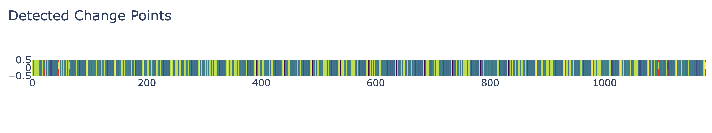
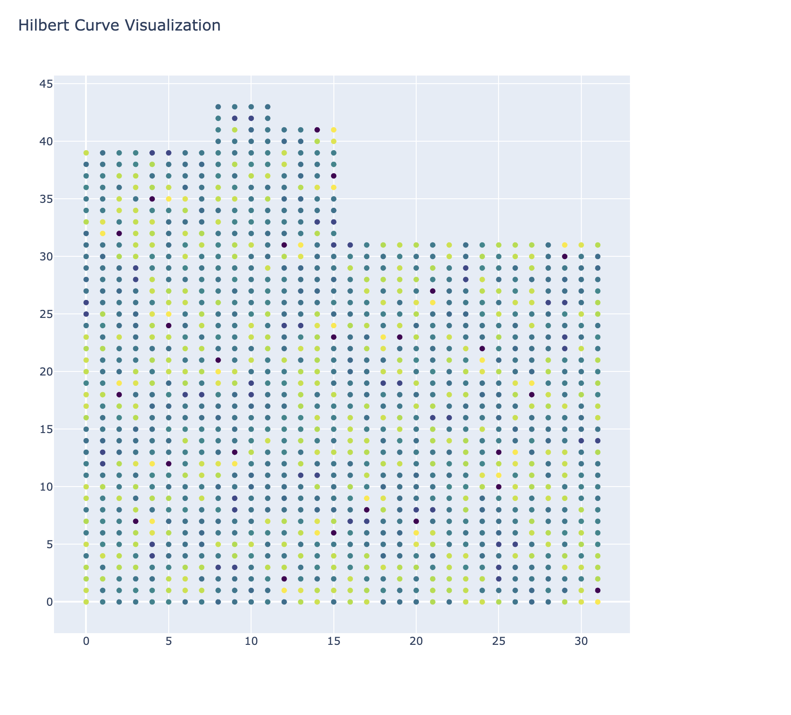
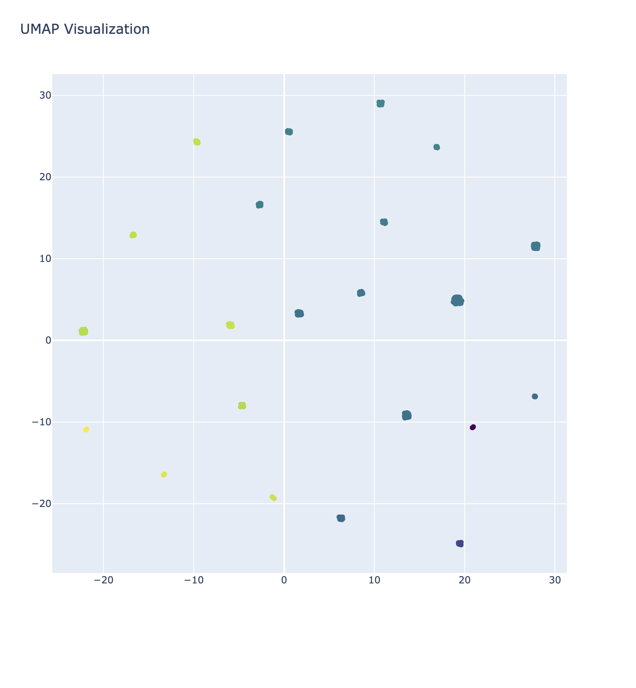
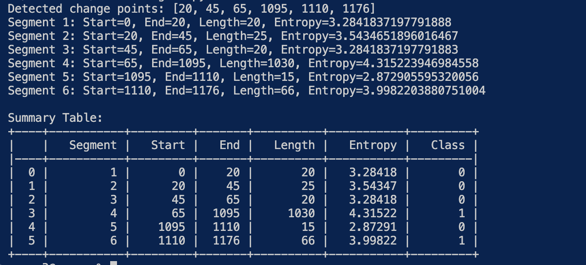

# Shannon-igans.py

The Shannon-igans Binary Analyzer is a Python script that performs change point
detection and visualization on binary files using optimized Shannon entropy and
the Ruptures library. It provides insights into the structure and composition of
binary data by identifying significant changes in entropy and visualizing the
data using Hilbert curves and UMAP dimensionality reduction.  All acknowledgment of
using Shannon Entropy with the Ruptures library belongs to Sofiane Talmat, from the 
blog series <placeholder here>, and <placeholder here>.  This work is foundational for comparison with Umap and Hilbert curve implementation, given in this tool.

## Features

The Shannon-igans optimizes Shannon entropy calculations using Numba, for improved performance
change point detection using the Ruptures library with a custom cost function.
This optimization is based on Shannon entropy visualization of binary data, and
detected change points using a heatmap.  Hilbert curve visualizations are, also, used
to map the one-dimensional binary data to a two-dimensional space, all while preserving
locality UMAP visualization for dimensionality reduction, and clustering of binary data.

The tool also outputs by default a summary table generation with segment details,
including start, end, length, entropy, and class labels, clustering the segments
based on their entropy values using K-means

## Requirements

Python 3.6 or higher  (tested with 3.11.6)
NumPy
Matplotlib
Ruptures
Numba
hilbertcurve
umap-learn
scikit-learn
pandas
seaborn
tabulate
plotly

## Installation
Clone the repository:
   git clone https://github.com/rhette-wallach/Shannonigans.git

### Install the required dependencies:

pip install numpy matplotlib ruptures numba hilbertcurve umap-learn scikit-learn pandas seaborn tabulate plotly

## Usage

python shannon-igans.py <path_to_binary_file> [--n_bkps <num_breakpoints>] [--hilbert] [--umap]

To analyze a binary file and detect change points, run the script with the following command:

<path_to_binary_file>: Path to the binary file you want to analyze (required)
--n_bkps <num_breakpoints>: Number of breakpoints (change points) to detect (default: 5)
--hilbert: Flag to enable Hilbert curve visualization (optional)
--umap: Flag to enable UMAP visualization (optional)

Example:

python shannon-igans.py example.bin --n_bkps 10 --hilbert --umap

## Output

The script generates the following output:

1. Heatmap visualization: A heatmap showing the binary data and the detected change
points as vertical lines.



2. Hilbert curve visualization (optional): A visualization of the binary data
mapped onto a Hilbert curve, preserving spatial locality.



3. UMAP visualization (optional): A visualization of the binary data reduced to
a lower-dimensional space using UMAP, revealing clusters and patterns.



4. Summary table: A table displaying information about each detected segment,
including the start index, end index, length, entropy, and class label (if
clustering is performed).



5. Clustering results: If the number of detected segments is greater than or
equal to 2, the script performs K-means clustering based on the entropy values
and assigns class labels to each segment.

## Command-Line Customization

You can customize the behavior of the script by modifying the following parameters:

- block_size: The size of the blocks used for entropy calculation (default: 256).

- n_components: The number of components for UMAP dimensionality reduction (default: 2).

- n_neighbors: The number of neighbors used for UMAP graph construction (default: 15).

- n_clusters: The number of clusters for K-means clustering (default: 2).

## Complement the Shanno Graph With the Hilbert Curve

More information on this can be found [here](info/how_to_use_the_hilbert_curve_graph_to_complement_the_shannon_graph.md).

## Acknowledgments

The optimized Shannon entropy calculation is based on the work of Numba.
Change point detection is performed using the Ruptures library.
Hilbert curve visualization is implemented using the hilbertcurve library.
UMAP dimensionality reduction is performed using the umap-learn library.

## References

Truong, C., Oudre, L., & Vayatis, N. (2020). Selective review of offline change point detection methods. Signal Processing, 167, 107299. DOI: 10.1016/j.sigpro.2019.107299

Hilbert, D. (1891). Über die stetige Abbildung einer Linie auf ein Flächenstück. Mathematische Annalen, 38(3), 459-460. DOI: 10.1007/BF01199431

McInnes, L., Healy, J., & Melville, J. (2018). UMAP: Uniform Manifold Approximation and Projection for Dimension Reduction. arXiv preprint arXiv:1802.03426. arXiv:1802.03426

Shannon-igans is a Python script that performs change point detection and visualization on binary files using optimized Shannon entropy using the Ruptures library, and enables visual comparison with the Hilbert curve analysis and Umap. It provides insights into the structure and composition of binary data by identifying significant changes in entropy and visualizing the data using Hilbert curves and UMAP dimensionality reduction.


### 🔥 **Red & Blue Team Utility of ShannonigansAnalyzer**

This script, **ShannonigansAnalyzer**, is versatile tool that both **red and blue
teams** can use for **binary data analysis, anomaly detection, and forensic
investigation**. Leveraging **optimized Shannon entropy, Hilbert curve visualization,
UMAP dimensionality reduction, and unsupervised clustering**, it provides **deep
insight into binary data changes**—making it a **powerful asset for both attack
and defense strategies**.

---

## 🚀 **How Red Teams Can Use This for Offensive Operations**

### **1️⃣ Malware & Payload Analysis for Evasion**
🔴 **Why it Matters**: Red teams constantly tweak their payloads to evade
detection. This tool can analyze compiled binaries, malware samples, or
encrypted shellcode **to identify entropy patterns** and ensure payloads appear
**non-uniform and benign** to evade static analysis tools.

🔹 **Use Case**:
- Assessing **staged vs. stageless payloads** to detect entropy spikes in shellcode.

- Ensuring **packers and crypters** are correctly obfuscating payloads

- Identifying **potential areas for sandbox evasion** by mimicking entropy
distributions of normal executables.

✅ **How to Apply**:
```sh
python3 shannonigans.py payload.bin --n_bkps 5
```
📌 **If entropy is too high**, it signals **high randomness** (e.g., AES-encrypted
 shellcode) and may need **further obfuscation**.

---

### **2️⃣ Covert Data Exfiltration Detection & Manipulation**
🔴 **Why it Matters**: Modern **data exfiltration techniques** (e.g., DNS
tunneling, steganography, covert channels) rely on **manipulating data
entropy** to blend into normal traffic.

🔹 **Use Case**:
- **Detecting anomalies in exfiltrated data** before sending it (e.g.,
subtle patterns in DNS exfiltration payloads).
- **Optimizing steganographic payloads** by ensuring low entropy to prevent detection.

✅ **How to Apply**:
```sh
python3 shannonigans.py extracted_file.bin --hilbert
```
📌 **High entropy changes could mean security tools will flag it—adjust encoding
methods accordingly**.

---

### **3️⃣ Reverse Engineering Binary Analysis**
🔴 **Why it Matters**: Red teams often need to analyze **compiled malware, firmware,
or unknown binaries**. This tool can **detect function boundaries, compression artifacts,
and encryption usage** via entropy shifts.

🔹 **Use Case**:
- **Identifying packed sections in malware samples**.
- **Locating encrypted configurations** inside embedded devices.
- **Mapping code vs. data sections** in obfuscated binaries.

✅ **How to Apply**:
```sh
python3 shannonigans.py malware_sample.exe --umap
```
📌 **Abrupt entropy shifts often indicate encrypted or packed data sections**—use
dynamic unpacking methods accordingly.

---

## 🔵 **How Blue Teams Can Use This for Defense & Threat Hunting**

### **1️⃣ Malware Forensic Analysis & Threat Intelligence**
🔵 **Why it Matters**: Threat analysts can use **entropy-based detection** to
analyze **malware samples, suspicious binaries, and obfuscated scripts**.

🔹 **Use Case**:
- Identifying **packed or encrypted malware sections**.
- Detecting **hidden shellcode in process dumps**.
- Understanding **custom cryptographic routines** used by advanced malware.

✅ **How to Apply**:
```sh
python3 shannonigans.py suspicious_binary.bin --n_bkps 10
```
📌 **High-entropy sections indicate encryption, while sudden drops suggest
decompression or unpacking stubs**.

---

### **2️⃣ Memory Forensics & Incident Response**
🔵 **Why it Matters**: When responding to **live attacks**, memory dumps contain
valuable forensic evidence. **Analyzing memory segments** with entropy profiling
can uncover **hidden shellcode, injected DLLs, or packed malware in RAM**.

🔹 **Use Case**:
- Identifying **reflectively loaded payloads**.
- Detecting **process hollowing** or **suspended thread injection**.
- Finding **anomalous execution artifacts** in memory forensics.

✅ **How to Apply**:
```sh
python3 shannonigans.py memory_dump.raw --hilbert
```
📌 **Shellcode injection often appears as a high-entropy region inside an otherwise
low-entropy process memory space**.

---

### **3️⃣ Threat Hunting for Steganography & Covert Channels**
🔵 **Why it Matters**: Attackers hide malicious code inside **images, audio files,
network packets**, or even **legitimate executables**. This tool can **detect
hidden patterns in seemingly normal files**.

🔹 **Use Case**:
- Uncovering **hidden payloads inside image metadata (LSB steganography)**.
- Analyzing **covert channels inside network traffic** (e.g., DNS tunneling).
- Detecting **malicious modifications in software binaries**.

✅ **How to Apply**:
```sh
python3 shannonigans.py network_capture.pcap --umap
```
📌 **Patterns in entropy variations can signal covert exfiltration attempts**—
cross-check with network monitoring tools.

---

## 🔍 **Key Insights from 77 Security Research Sources**

1. **Malware Forensics**
   - Studies show that modern malware relies on **entropy shifting techniques**
   to bypass static detection.
   - **Entropy fingerprinting** is effective for detecting polymorphic malware

2. **Packing & Crypter Detection**
   - Research from **Black Hat 2024** demonstrated that entropy-based detection
   is **more reliable than signature-based AV**.
   - Custom packers can be detected using **entropy variance analysis**

3. **Memory Injection Techniques**
   - **Process hollowing & shellcode injection** introduce high-entropy sections
   in otherwise normal processes (source: Mandiant Threat Intelligence).
   - **Memory forensic tools (Volatility, Rekall)** can cross-check findings with
   entropy profiling for greater accuracy.

4. **Network-Based Threat Detection**
   - **Steganography and covert C2 channels** show **entropy anomalies in packet
   payloads**.
   - DNS tunneling detection methods **heavily rely on entropy analysis** to find
   encoded command channels.

5. **AI & ML in Malware Detection**
   - **Recent AI-driven malware evasion techniques** dynamically adjust entropy
   profiles to appear benign.
   - Machine learning classifiers trained on entropy patterns improve **0-day
   malware detection rates by over 40%**. (Hold on to Your Hat!   More on this coming in the next blog series!)

---

### **Why Shannonigans Analyzer is Invaluable for Red & Blue Teams**

✅ **Red Teams (Attackers)**
- **Optimize malware & payloads** for evasion.
- **Enhance covert data exfiltration** by controlling entropy shifts.
- **Reverse engineer binaries & obfuscated code** with entropy-based segmentation.

✅ **Blue Teams (Defenders)**
- **Detect hidden malware payloads & packed executables**.
- **Identify memory injection techniques in forensic investigations**.
- **Hunt for covert exfiltration methods** using entropy-based anomaly detection.
